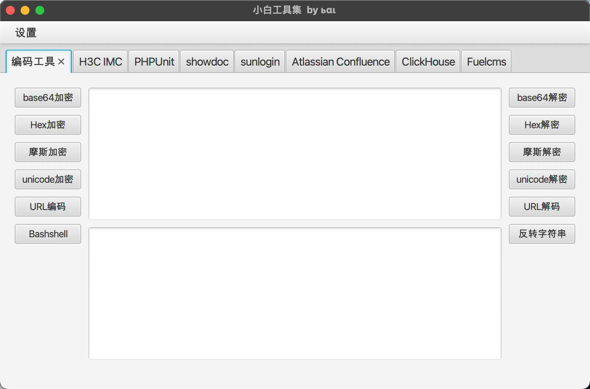
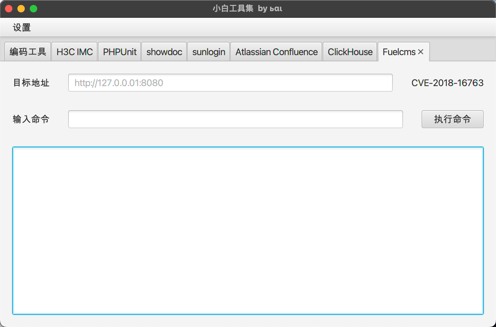
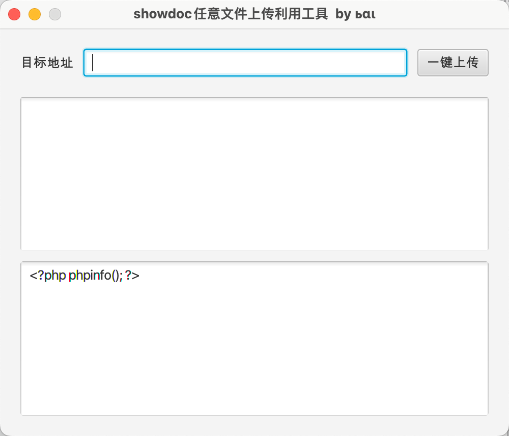
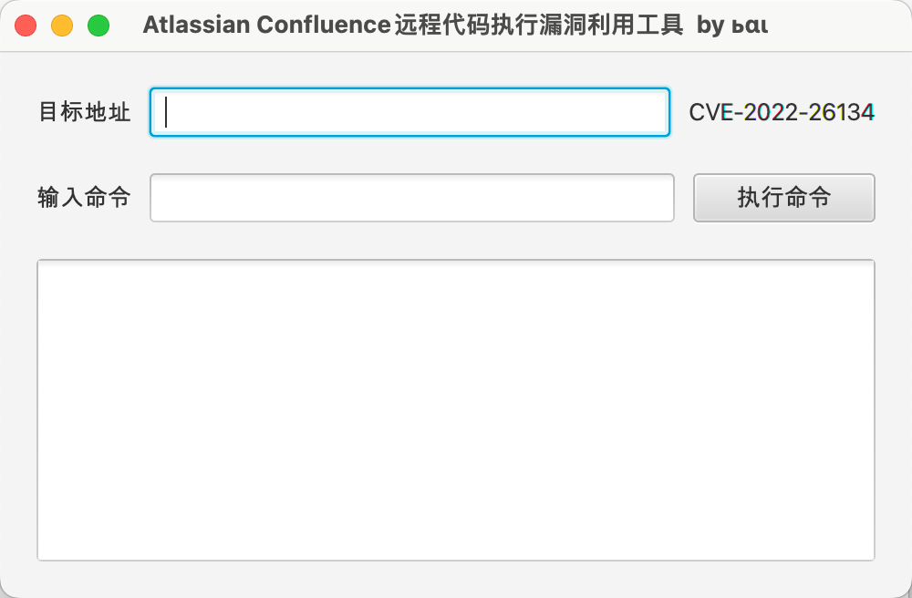
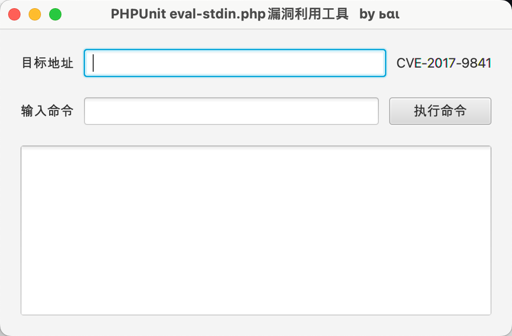
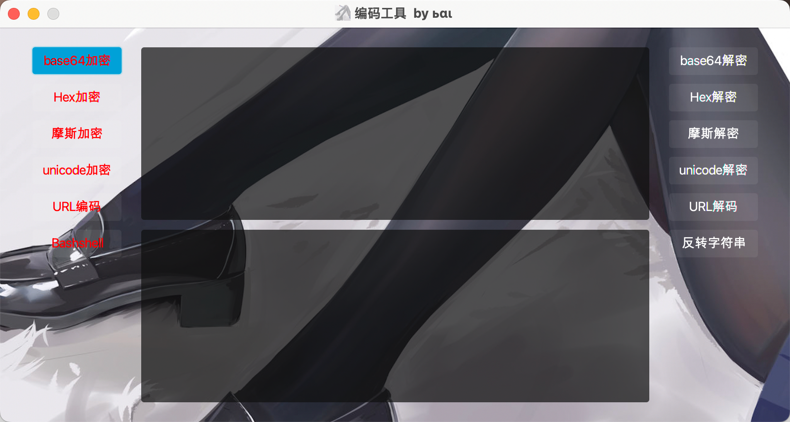

# javafx_tools
java图形化漏洞利用工具集

## 小白工具集

## Fuelcms

CVE-2018-16763

## showdoc

## Atlassian Confluence

CVE-2022-26134

## PHPUnit

CVE-2017-9841

## 编码工具

## H3C_IMC

## 向日葵

# ⚠️ 免责声明

​	此工具仅作为网络安全攻防研究交流，请使用者遵照网络安全法合理使用！ 如果使用者使用该工具出现非法攻击等违法行为，与本作者无关！
